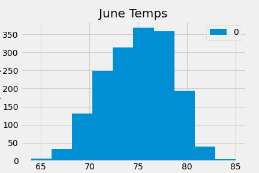

# surfs_up

## Overview of the statistical analysis (The purpose of the analysis is well defined.)
With the fanciest and cleanest beach, Oahu island is one of the most popular islands around the world. There are millions torists visit Oahu island every year which makes the island is a potential successful place for surf and ice cream shop business. In order to determine if the surf and ice cream shop business is sustainable year-round in Oahu, it is crucial to have a well weather analysis, specifically for the months of June and December. This analysis provides the temperatures in June and December to help W.Avy make plans for the business.

## Results (There is a bulleted list that addresses the three key differences in weather between June and December. )
Utilizing python and SQLite, this project provides through analysis about the tempature in June and December.

- The average temperature is around 74.9°F in June and 71.0°F in December.
  - Per the averange temperature, there is no big difference between June and December. It seems the temperature looks good for the surf and ice cream business.

- The lowest temperature is around 64.0°F in June and 56.0°F in December.
  - June's lowest temperature is still around 64°F, it still good for surfing and ice cream while the lowest temperature in Deceber is only approximately 56°F which is a little bit too cold for such business.
- The highest temperature is around 85.0°F in June and 83.0°F in December.
  - The highest temperature might not be an important factor for the business but we can tell that the range from June and December isn't too large.
- More than 50% tempature is above 75°F in June and 71°F in December.
  - As more than 50% of the time the temperature is above 70°F, I would recommand it's good for the business.

## Summary - There is a high-level summary of the results and there are two additional queries to perform to gather more weather data for June and December.)

- Query to provide precipitation data in June and December.
  - As important as temperature, we may also need to consider about the precipitation in June and December.

- Query to discribe average/max/min precipitation in June and Decmber
  - Per the plot pictures below, it displays clear understanding about the averange/maximin/minimne precipitation data in June and December

